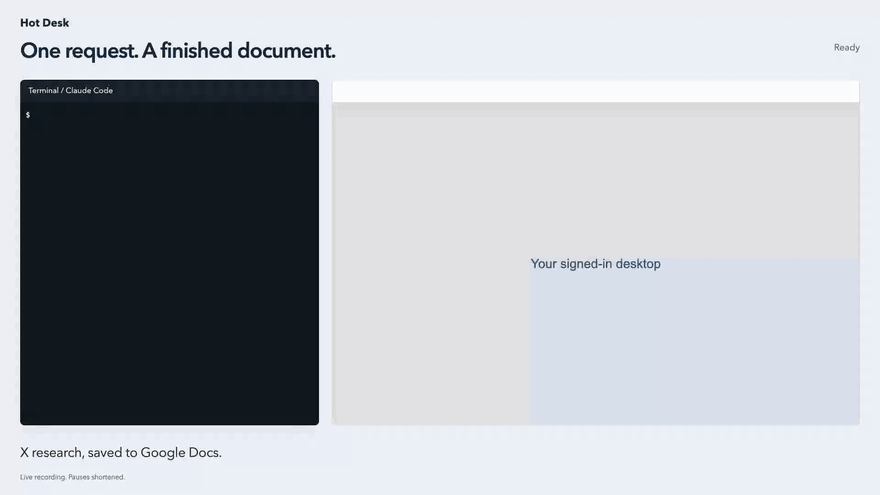

# Hot Desk

Persistent local Linux desktops for AI agents. Each desktop keeps its own home directory and Chromium profile across sessions. An agent reserves a desktop through MCP, and you watch or take over in the browser when it gets stuck.



Demo from [Agents love computers](https://www.jamalavedra.com/blog/agents-love-computers). Video: [hotdesk-x-to-docs.mp4](https://www.jamalavedra.com/blog/agents-love-computers/hotdesk-x-to-docs.mp4).

## How it works

- Desktops are Docker Compose services built on [trycua/xfce-cua](https://github.com/trycua/cua) with Chromium, TigerVNC, and noVNC.
- Inside each desktop, `cua-computer-server` provides computer tools (screenshot, click, type) and [Playwright MCP](https://github.com/microsoft/playwright-mcp) provides browser tools.
- A Python manager on the host owns reservations, proxies tool calls, and serves the noVNC viewer. It binds to `127.0.0.1` with token auth and stores reservations and operation history in SQLite.
- Agents connect through MCP for direct tool calls and screenshot images. Hot Desk does not run a model or need a model API key.

Status: development, no stable release. Requires macOS or Linux with a local Docker daemon. Windows hosts and remote Docker engines are unsupported. Desktops are containers sharing Docker's kernel, not VMs.

## Quick start

Requires Docker with Compose, Python 3.11+, and [uv](https://docs.astral.sh/uv/). The example desktop needs 2 GiB of memory on top of Docker's own usage.

```sh
git clone https://github.com/jamalavedra/hotdesk.git
cd hotdesk
cp -n hotdesk.example.toml hotdesk.toml
uv sync --locked
uv run hotdesk open            # start the manager
uv run hotdesk up              # build the image, start configured desktops
uv run hotdesk open research   # take control and open the viewer
```

Sign in to websites in Chromium, then hand the desktop back with the viewer's **Return control to agents** button or `uv run hotdesk release research`. `open research --observe` opens a read-only viewer. Closing the viewer neither stops the desktop nor releases control.

Install the command for use outside the checkout:

```sh
uv tool install --editable .
hotdesk default --config-path /absolute/path/to/hotdesk/hotdesk.toml
```

The tool environment uses the package's dependency constraints. For the exact lockfile, keep using `uv run hotdesk` from the checkout.

Config resolution order: `--config PATH`, then `./hotdesk.toml`, then the remembered default in `~/.local/state/hotdesk/default.json`. The CLI finds the manager through private local state, so no port is needed. The manager prefers port 7890 and falls back to a free loopback port.

## Agent usage

Connect your agent's MCP client to one workspace using this stdio server configuration. Use absolute paths so it works outside the checkout:

```json
{
  "mcpServers": {
    "hotdesk-research": {
      "command": "hotdesk",
      "args": ["--config", "/absolute/path/to/hotdesk.toml", "mcp", "--workspace", "research"]
    }
  }
}
```

If `hotdesk` is not on the client's PATH, use its absolute executable path. Each connection gets its own identity and is bound to the named workspace. No tokens or model API keys go in this configuration.

The agent receives the browser, computer, and workspace tool schemas directly. Tell it "Use the Research Hot Desk desktop for this task."

Rules:

- Each browser or computer call acquires or renews a five-minute reservation. Listing tools does not. Call `workspace_renew` during long pauses and `workspace_release` when the task ends.
- Tool calls run one at a time per connection; discovery requests wait their turn. Other connections get `WORKSPACE_BUSY` with the owner and latest checkpoint while the desktop is reserved or under human control.
- Tool errors are returned without retrying. Hot Desk does not save screenshot files on the host.
- A stopped desktop exposes only workspace tools. Call `workspace_acquire`, then refresh the tool list.
- Disconnecting attempts to release the reservation. After an abrupt exit, an idle reservation expires; an uncertain action still requires recovery.
- The manager tracks tool calls, not detached guest processes. The agent must finish or stop those before release or takeover.

MCP supplies the agent instructions at connection time, including account checks, handoff, and clone rules. `hotdesk skill` prints the same instructions for inspection.

### Checkpoints and clones

A checkpoint is a copy of a stopped, idle desktop's home: files and browser storage, no running processes. Each workspace keeps one checkpoint. Taking a new one replaces it.

```sh
hotdesk stop research
hotdesk checkpoint research
hotdesk start research
```

When a desktop is busy, the agent must ask the user whether to wait or clone the checkpoint, stating the checkpoint's age. Clones are never automatic.

```sh
hotdesk clone research research-copy --checkpoint CHECKPOINT_ID --user-approved
```

Connect a separate MCP server with `--workspace research-copy` to use the clone, and call `workspace_release` before running `hotdesk discard research-copy --outputs-saved`.

A clone runs the checkpoint's image with its own writable copy of the checkpoint's home. It excludes later source changes, never merges back, and keeps its local state across release and manager restarts. It shares the source's signed-in accounts, so anything posted or edited online from the clone stays online after discard. The example config allows one running desktop. Raise `max_running` and `memory_budget` before running source and clone together.

`--user-approved` records that the user chose the clone. It cannot verify that, so agents must ask first. `--outputs-saved` confirms needed outputs are saved elsewhere or none exist. `discard` refuses to delete a configured source workspace.

### Credentials and payments

[Valet](https://github.com/joalavedra/valet) v0.1.0 is an optional credential and payment broker. The default image leaves it out. To include it, build with `HOTDESK_VALET=1`, set `image = "hotdesk-desktop:valet"` under `[project]` in `hotdesk.toml`, and run `hotdesk apply`:

```sh
docker build --build-arg HOTDESK_VALET=1 -t hotdesk-desktop:valet desktop
```

A desktop with Valet adds five tools to its workspace MCP server: `list_handles`, `request_grant`, `http_call`, `browser_fill`, and `pay`. Agents refer to secrets by handle and never see the values. To log in, call `browser_navigate`, then `request_grant` for the handle, then `browser_fill` with the tab's `page_url`. Valet types the login into the desktop's Chromium.

Only logins work out of the box. Valet doesn't inject API keys or cards itself: `http_call` sends requests through an [Infisical Agent Vault](https://github.com/Infisical/agent-vault) proxy, and `pay` goes through a [VGS](https://www.verygoodsecurity.com/) card vault. Hot Desk configures neither, so `http_call` returns `egress not configured` and `pay` returns `pay failed`.

Desktops without Valet don't list these tools, and calling one returns an error saying Valet is not enabled. If Valet crashes, only these five tools stop working.

Add credentials from the host. The container is named `<project>-desktop-<workspace>-1`:

```sh
docker exec -it hotdesk-desktop-research-1 start-valet.sh cli cred add --type login --site github.com --label me
docker exec hotdesk-desktop-research-1 start-valet.sh cli cred list
```

Valet keeps its SQLite database and the master key that encrypts it in `/home/cua/.valet`. That directory is on the home volume, so checkpoints, clones, and backups include both. A separate `valet` user owns it with mode 0700, so the agent's `cua` user can't read it directly. `cua` has passwordless sudo, though, so an agent that wants the secrets can get them. Running Valet outside the desktop container would close that gap.

## Configuration

```toml
[project]
name = "hotdesk"        # unique per Docker engine; one manager per project
max_running = 1
memory_budget = "2g"

[profiles.research]
label = "Research"
cpus = 2                # CPU-time cap, not a core reservation
memory = "2g"

[desktops.research]
profile = "research"
```

A profile names a persistent Docker volume and its limits. Each profile belongs to one desktop, and the desktop name is the workspace identifier. Renaming a label keeps the volume. Renaming the project or profile selects a different volume.

Apply changes while every workspace is idle:

```sh
hotdesk plan              # print the generated Compose config
hotdesk apply --no-build
```

`up` builds `hotdesk-desktop:<package version>` unless `project.image` names an existing tag, image ID, or digest. `up --no-build` reuses the built image.

## Commands

| Command | Effect |
|---|---|
| `hotdesk status` | Readiness, ownership, and resource usage as JSON |
| `hotdesk doctor` | Check Docker, Compose, image, and manager |
| `hotdesk open research` | Start if stopped, take control, open the viewer |
| `hotdesk open research --observe` | Read-only viewer |
| `hotdesk release research` | Return control to agents |
| `hotdesk stop research` | Stop a desktop, keeping its home |
| `hotdesk start research` | Start a stopped desktop |
| `hotdesk recover research` | Restart a desktop stuck in recovery |
| `hotdesk backup research FILE.tar` | Archive a stopped, idle workspace |
| `hotdesk restore research FILE.tar` | Validate the archive and write it to a fresh volume for a stopped, idle workspace, keeping the old volume |
| `hotdesk down` | Remove containers and networks, keeping homes |
| `hotdesk manager-stop` | Stop an idle manager, leaving desktops running |
| `hotdesk manager-logs --lines 50` | Tail the manager log |
| `hotdesk versions` | Host dependencies, image ID, and the image's package inventory |

Lifecycle commands need a running manager. Human takeover blocks new agent actions on that workspace at once, then waits for the in-flight one. Takeover survives manager restarts. After a restart, reopen viewer tabs; MCP connections refresh credentials on their next call.

An uncertain tool outcome puts the workspace into recovery. Inspect it in the viewer and `status` before running `recover`, which restarts the desktop and drops unsaved work. Recovery cannot undo submitted forms, posts, or cloud document edits.

## State and security

Homes are Docker volumes mounted at `/home/cua`. Files and browser profiles survive container recreation. Process memory and packages installed outside the home do not. Add lasting system packages to `desktop/Dockerfile` and rebuild.

Runtime state lives in `.hotdesk/<project>/` next to the config. Manager discovery lives in `~/.local/state/hotdesk/projects/`. The manager pins the Docker context it started on and refuses lifecycle commands from another. Volumes do not move between engines.

Runtime state holds the manager credentials. Checkpoints and backups hold signed-in browser profiles. Keep all of them private and never expose Hot Desk ports beyond loopback. Agents have administrator access inside the guest and can reach the host's network. See [SECURITY.md](SECURITY.md).

## Login startup

macOS only:

```sh
hotdesk service install
hotdesk service status
hotdesk service uninstall
```

This starts the manager at login, not Docker or the desktops. Docker's `unless-stopped` policy restarts desktops on its own. `manager-stop` keeps the login registration; `service uninstall` removes it. Both refuse to stop an active session. Reinstall after moving the checkout, interpreter, or config. On Linux, run `hotdesk serve` under your process manager.

See [MAINTENANCE.md](MAINTENANCE.md) for updates and release checks, and [CONTRIBUTING.md](CONTRIBUTING.md) for tests.

Hot Desk's own code is MIT. The desktop image bundles software under other licenses; see [NOTICE](NOTICE) and [desktop/NOTICE](desktop/NOTICE).
